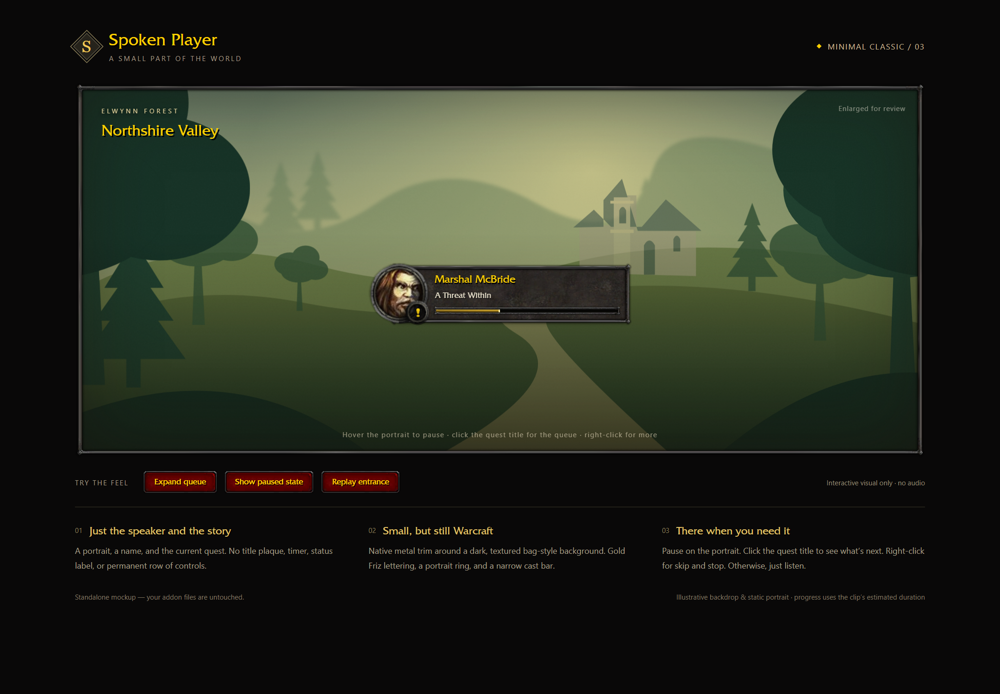
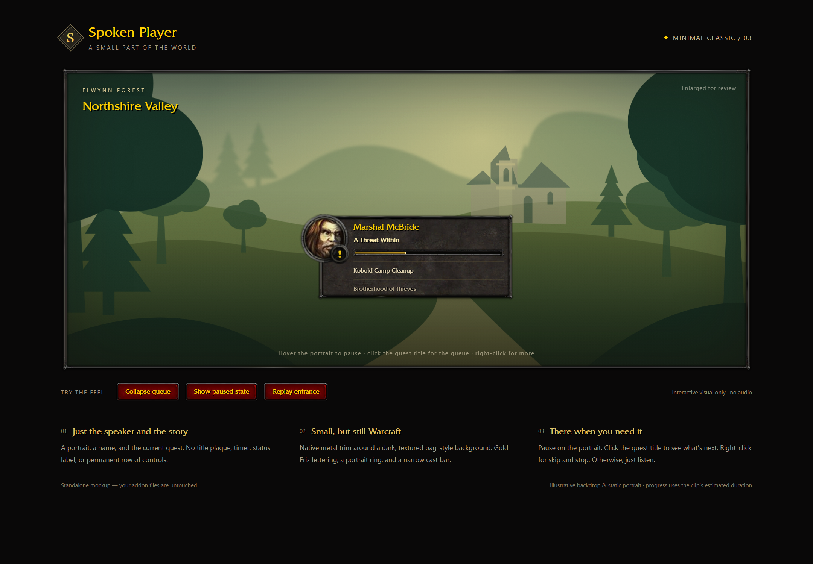

# Minimal Classic player

A compact alternative layout for SpokenPlayer, ported from 2.0.4 onto upstream
2.1.0, [`master` at `56f910b`](https://github.com/rusty-key/spoken-wow/commit/56f910b).
This is a community fork, not an official Spoken release.

The player shows a round native still portrait, gold speaker name, narration
title and narrow cast-style progress bar. There is no permanent button row.
The dark rock background and metal trim use WoW artwork.

## Install from this branch

1. Download this branch using **Code → Download ZIP**, or clone it:

   ```sh
   git clone --branch minimal-classic-ui --single-branch https://github.com/Gian-MarcoModer/spoken-wow.git
   ```

2. Back up your existing `Interface/AddOns/SpokenPlayer` folder.
3. Copy `addons/SpokenPlayer` from this repository into your WoW client's
   `Interface/AddOns` folder, replacing the existing player. The folder must
   be named `SpokenPlayer`, with its `.toc` files directly inside it.
4. Copy `addons/SpokenContributions` alongside it, as required by the upstream
   2.1.0 packaging. Keep your feature addon (such as SpokenQuests) and audio packs.
5. Restart the client after adding the files, then try a known voiced quest.

This branch contains the **2.1.0** player plus the layout. In-game validation
used the 2.0.4-based layout in the modern Classic beta client; the 2.1.0 port
is checked separately with the offline suites. Other modern flavors have not
been visually verified. Original
private-server 1.12/2.4.3/3.3.5 clients continue using the original layout.
Addon-manager updates can replace this fork with the official player.

## Controls

| Interaction | Action |
|---|---|
| Click portrait | Pause, or restart the line from the beginning |
| Click narration title | Skip the line, as in the original player |
| Click plus/minus button | Expand/collapse the waiting queue |
| Scroll expanded queue | Browse more than four waiting lines |
| Click waiting line | Remove it from the queue |
| Right-click portrait, speaker, title or panel | Playback menu and source actions, including Report/Stop Gossip |
| Drag speaker name or panel | Move the unlocked player |
| Hover collapsed player | Reveal the resize grip |
| `/sp options` | Toggle **Minimal Classic player**, scale, lock and visibility settings |
| `/sp reset` | Reset the active layout's position and width |
| `/sp diagnostics` | Inspect playback, UI state and captured callback errors |

The layout is enabled by default in this fork. Turn off **Minimal Classic
player** to return to the original layout. Existing hidden-portrait,
hidden-player and optional-action settings remain effective.

An empty queue hides the player. Test a quest with available narration when
checking it. WoW cannot resume a sound partway through: play after pause
restarts the line, and the progress bar resets accordingly.

## Design previews

These are screenshots of the browser mockup used to review the design,
not captures of the WoW client. Actual portrait appearance comes from the game.





## Implementation

- `addons/SpokenPlayer/UI/MinimalPlayer.lua`: layout, menu, queue drawer,
  progress and fades over the existing queue/actions services.
- `addons/SpokenPlayer/UI/StaticPortrait.lua`: native `SetPortraitTexture`
  snapshots captured while the speaker's unit token still exists.
- Small integration changes in `addon.xml`, `API.lua`, `Core.lua`,
  `Strings.lua`, `UI/Options.lua` and `UI/PlayerFrame.lua`.
- Nine power-of-two RGBA textures under `Textures/Minimal*.tga`.

Portraits are cached as native Texture regions, keyed by exact unit GUID,
with at most 32 entries. Queued/current portraits are protected from eviction.
Synthetic quest-log identities may use an encountered portrait of the same
creature type. Missing portraits use the source image/book fallback rather
than borrowing an unrelated target's face.

Source-owned action buttons retain their original handlers. The public player
frame API returns the selected layout. The queue and narration producer are
the upstream implementations.

## Verification

The existing offline integration harness is included in
[`tests/minimal-classic`](../../tests/minimal-classic/README.md). It exercises
the real queue and UI code, including pause/restart timing, held gates,
pagination/removal, source actions, visibility settings, original-layout
fallback, portrait identity/cache/fallback and artwork dimensions.

The original-layout regression tests remain in `tests/lua` and run with
`make test-player` (LuaJIT or Lua 5.1). Their loader includes the new modules
and explicitly selects the original layout.

**In-game status (2026-09-22):** the final native-static-portrait, inset-border
and opaque-badge revision was confirmed working in the Classic beta client
on the 2.0.4-based installation. Two player-supplied screenshots show Gryan
Stoutmantle's greeting and The People's Militia narration, including the
right-click menu. The player confirmed all requested checks: appearance,
portrait identity after dialogue/target changes, playback/queue/menu controls
and switching back to the original layout.

The same UI implementation is now integrated with upstream 2.1.0, preserving
its contribution features and scrolling settings panel. The port is verified
with the offline integration and upstream regression suites; the screenshots
document the earlier 2.0.4-based runtime. Offline fixtures do not emulate WoW
rendering.

## Credits

Original addon: [rusty-key/spoken-wow](https://github.com/rusty-key/spoken-wow).
The upstream MIT license is retained. Game-derived textures remain Blizzard
Entertainment artwork; see [`THIRD_PARTY.md`](../../THIRD_PARTY.md) and
[`ARTWORK.md`](ARTWORK.md) for sources.
