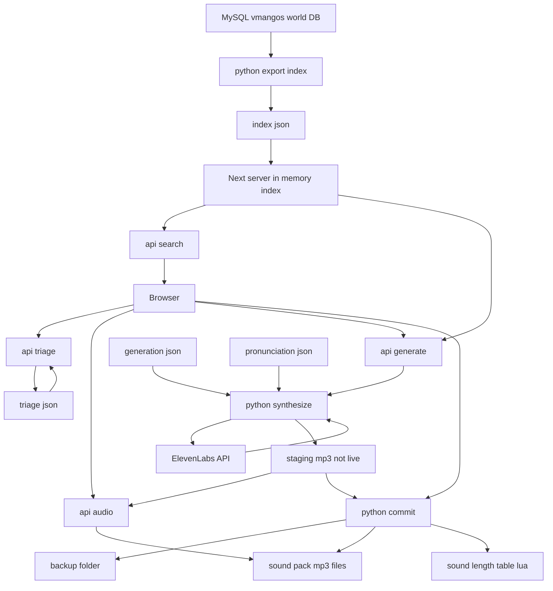

# Voiceline Explorer — Design

Date: 2026-07-27
Status: **partly superseded** — see "What changed" below.

> ## What changed
>
> This spec was written while the project was still shaped as an addon that patched a
> pre-built sound pack. The pipeline was then restructured so the sound pack and data
> module are build outputs, which invalidates several of its constraints.
>
> | This spec says | Now |
> |---|---|
> | `web/data/index.json`, exported per-run | `corpus/corpus.json.gz`, committed |
> | `hasAudio` lives in the index | belongs to the audio store; the corpus carries no audio state |
> | "never regenerate lookup tables" | the module is built, so tables are emitted by construction |
> | "gossip is fix-existing-only" | dissolved with the constraint above; no stance taken on gossip |
> | `tts_cli/index_export.py`, `tts_cli/config/` | `tts_cli/corpus.py`, `voice/` |
>
> What survives intact is the explorer itself: search, audition and triage over line data,
> and the audio-serving and staging design. Those read the corpus just as happily as they
> would have read the index. The generation half is largely implemented already, in
> `tts_cli/voice_config.py`, `tts_cli/synthesize.py` and `tts_cli/select.py`.
>
> Kept as-is rather than rewritten, because the reasoning it records — particularly why
> filename derivation must live in one place — is still what the code depends on.

## Context

`wow-voiceover` generates AI voiceovers for WoW Classic quest and gossip text. The audio is
generated once by a Python CLI (`tts_cli/`) and shipped as a separate data addon. Two defects in
the shipped audio motivated this work:

1. **The same NPC sounds like several different people across their lines.** There is one
   ElevenLabs voice per `race-gender` pair, so an NPC always uses the same clone; what varies is
   the sampling. `tts()` sends `stability: 0.28` / `similarity_boost: 0.992`, no `model_id` and no
   `seed`, so every line is an independent draw at near-maximum latitude.
2. **Lore names and short words are mispronounced** — "Hm" is read as the letters "H M". Nothing
   normalizes text for speech.

Finding these defects currently requires logging into the game and talking to NPCs, because
**nothing in a filename identifies the NPC**: quest audio is `{questID}-{accept|complete}.mp3` and
gossip audio is `md5(original_text + race + gender).mp3`. An NPC's lines are scattered across ~9,500
files with no shared key. `tools/audit_npc.py` reconstructs that view on the CLI, but auditioning
and flagging hundreds of lines needs a real interface.

**Intended outcome:** a local web app that is both the audit surface and the control plane — search
and audition lines, flag bad ones by category, and regenerate them with tuned settings, without
touching the game.

## Scope

In scope:
- **Explorer + triage** — search by NPC id/name, quest id/title, voice, and text; play lines in the
  browser; flag lines with a category and note; reports for gaps and problems.
- **Generation control plane** — regenerate selected lines via ElevenLabs, tune generation settings
  and the pronunciation dictionary from the UI, audition before committing.

Explicitly out of scope (separate specs):
- In-game feedback via addon `SavedVariables`. WoW addons cannot make HTTP requests, so this needs
  the addon to record reports into `VoiceOverDB` and the app to parse that Lua file.
- Crowdsourced multi-user feedback. That needs a companion uploader per player and is the product
  described in `RETAIL-PLAN.md`.

## Known constraints

These are established facts from the Step 0 environment validation, not assumptions.

**The installed pack is an older data-module format.** It ships `gossip_file_lookups.lua` where
current `tts_cli` code emits `npc_gossip_file_lookups.lua`, and it lacks all object/item tables.
`Module.lua`, sound paths, and `X-VoiceOver-DataModule-Version: 1` are identical, so *audio*
regeneration is compatible. **Lookup tables must never be regenerated** — that would change the file
set the TOC lists and break the pack.

**Gossip is fix-existing-only.** Gossip filenames are content hashes. Today's vmangos snapshot
reproduces 99.1% of installed gossip hashes and 98.2% of quest filenames, but it also yields 760
gossip lines the pack never covered. Those cannot be made reachable without regenerating the gossip
lookup table, which the previous rule forbids. Quest lines are immune — their filenames are
questID-based, so new quest coverage is safe to add.

**The addon indexes sound by table, not by filesystem.** `DataModules:PrepareSound`
(`AI_VoiceOver/DataModules.lua:437`) uses `SoundLengthLookupByFileName` as both the existence check
and the queue timer. A regenerated file whose duration changed will be cut off or leave dead air
until `sound_length_table.lua` is rewritten.

**Generation is currently blocked.** The ElevenLabs account is free tier with 0 voice clones, and
cloning requires Starter or above. The explorer half works today against the installed pack; the
generation half cannot be exercised until voices named `race-gender` exist.

## Architecture

The load-bearing constraint is that **filename derivation must exist in exactly one place**. Gossip
names are `md5(original_text + race + gender)` computed after a specific preprocessing chain
(`$B`/`$N`/`$G` expansion, tag stripping) in `TTSProcessor.preprocess_dataframe`. Reimplementing
that in TypeScript would eventually differ by one character and write a file the addon can never
find — failing silently. So ownership splits by that logic, not by language preference.

**Python owns everything touching naming, hashing, or audio.** Three JSON-in/JSON-out commands:

| Command | Responsibility |
|---|---|
| `export-index` | `query_dataframe_for_all_quests_and_gossip` + `preprocess_dataframe` → `index.json`, every line with a stable `lineId`, text, voice, filename, `hasAudio` |
| `synthesize` | one line → ElevenLabs → mp3 in a **staging** dir; returns duration and character cost |
| `commit` | back up original, promote staged mp3 into the pack, rewrite `sound_length_table.lua` via existing `write_sound_length_table_lua` |

**Next.js owns UI, triage state, and orchestration.** It shells out to those commands and never
derives a filename itself.

Grouping, since the diagram omits subgraphs: `DB`/`EXP` are build-time only; `MEM`–`GENAPI` are the
Next server; `SYN`/`CMT` are Python; `BAK`/`MP3`/`LEN` are the installed pack.

Consequences worth naming:
- **MySQL is build-time only.** After `export-index`, neither browsing nor generating touches the
  DB — generation reads `original_text` and voice from the index.
- **`api audio` serves both staged and live files**, which is what makes auditioning a new take
  against the current one possible before committing.
- **Only `commit` writes to the pack**, so backup-then-write and never-touch-lookup-tables are
  enforced in one place.
- **Config is data, not code.** `generation.json` (model, stability, similarity, seed strategy) and
  `pronunciation.json` (normalization dict) are read by Python and edited in the UI.

### File locations

All paths relative to the repo root. Everything under `web/data/` and `var/` is gitignored except
the two config files, which are committed so settings are versioned.

| Path | Contents | Committed |
|---|---|---|
| `web/data/index.json` | exported line index | no |
| `var/triage.json` | triage marks: `lineId` → category + note | no |
| `var/staging/` | freshly synthesized mp3s awaiting accept/discard | no |
| `var/backup/` | originals displaced by `commit`, namespaced by timestamp | no |
| `tts_cli/config/generation.json` | model, stability, similarity, seed strategy | yes |
| `tts_cli/config/pronunciation.json` | text normalization dict | yes |

The sound pack itself is outside the repo, located via `VOICEOVER_SOUNDS_DIR` — the same
environment variable `tools/audit_npc.py` already honors, defaulting to the `_classic_era_` install.

### Line identity

`lineId` is the stable key across index, triage, and generation. It is derived from what already
uniquely identifies a line in the pipeline:

- quest lines: `q:{questID}:{accept|complete}[:{m|f}]`
- gossip lines: `g:{hash}[:{m|f}]`

This is deliberately *not* the filename — it stays stable if a filename convention ever changes, and
it round-trips to a filename through Python only.

## Components

**`tts_cli/index_export.py`** — `export-index`. Reuses the existing query and preprocessing; adds
`lineId`, resolved filename, and `hasAudio` by stat-ing the sound dir. Emits `web/data/index.json`.

**`tts_cli/generation.py`** — `synthesize` and `commit`. `synthesize` applies `pronunciation.json`
to `cleanedText`, derives a per-NPC seed, calls ElevenLabs with settings from `generation.json`, and
writes to `staging/`. `commit` performs backup → move → length-table rewrite as one unit.

**`web/`** — Next.js App Router, TypeScript. Server-side: index loading, search, subprocess
orchestration. Client: search UI, line list, audio player, triage controls, settings editors.

**`tools/audit_npc.py`** — refactored to read `index.json` instead of querying MySQL directly,
so the CLI and web app share one source of truth.

## Data flow: regenerating a line

1. User flags line as `bad-delivery` in the browser → `POST /api/triage` → `triage.json`.
2. User clicks re-roll → `POST /api/generate` with `lineId`.
3. Next resolves the line from the in-memory index, shells out to `synthesize`.
4. Python applies pronunciation rules, computes seed, calls ElevenLabs, writes `staging/{lineId}.mp3`,
   returns duration + character cost.
5. Browser plays staged file via `api audio`, A/B against the live one.
6. Accept → `POST /api/commit` → Python backs up the original, moves the staged file into the pack,
   rewrites `sound_length_table.lua`. Discard → staged file deleted, nothing else changes.

## Error handling

- **ElevenLabs failure** (401, quota, 5xx) — surfaced to the UI with the status and message. No
  staged file is written, nothing in the pack changes. The free-tier/no-clones case is detected up
  front and shown as a banner rather than as a per-click failure.
- **Missing voice** — a line whose `race-gender` voice is absent from the account is marked
  non-generatable in the UI, with the required voice name shown.
- **Missing audio file** — `api audio` returns 404; the UI shows the line as a gap rather than
  erroring.
- **Stale index** — `export-index` records the vmangos dump identity; the UI warns if the pack on
  disk has drifted from the index.
- **Commit failure mid-way** — backup happens first, so a failed move or length-table write leaves
  the original recoverable. `commit` is not atomic across all three steps; it reports which step
  failed and leaves the backup in place.

## Testing

- **Python**: unit tests for `lineId` derivation and its round-trip to a filename, pronunciation-dict
  application, and seed determinism. A regression test asserting `cleanedText` changes never alter a
  computed filename — the core safety property.
- **`export-index` correctness**: assert the reconciliation numbers hold (≥98% of installed quest
  filenames and ≥99% of gossip hashes present in the index with `hasAudio: true`).
- **Web**: component tests for search filtering and triage state; an API test that `commit` writes a
  backup before touching the pack.
- **End-to-end**: run `export-index`, start the dev server, search for `Marshal Dughan` (NPC 240,
  16 lines / 15 with audio), play a line, flag it, confirm `triage.json`. Generation E2E is blocked
  until voice clones exist; until then `synthesize` is tested against a stubbed ElevenLabs response.

## Verification

- `.venv/bin/python -m tts_cli.index_export` produces `web/data/index.json` with ~17.5k lines.
- `pnpm dev` in `web/`, search `dughan`, get NPC 240 with 16 lines, one flagged as missing audio.
- Play `123-complete.mp3` — it opens with "Hm..." (the pronunciation defect, useful as a fixture).
- Flag it `bad-pronunciation`, confirm the entry lands in `triage.json`.
- `git status` in the WoW AddOns pack shows no changes from any read-only browsing.
